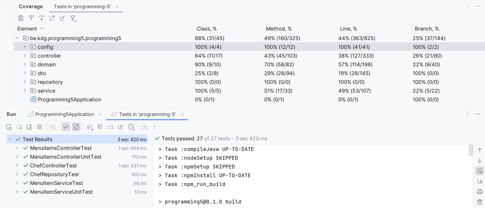

# Restaurant Management

**Course name:** Programming 5  
**Student name:** Noah Guerin  
**Email address:** noah.guerin@student.kdg.be  
**Student ID:** 0152794-19  
**Group:** ACS202

## Domain Entities

Chef >------< MenuItem ------ Recipe

## Build/Run Instructions

1. Run the docker-compose.yml file to start the database  
2. Run the application:  
```./gradlew bootRun```
3. Access the application at:  
```http://localhost:9242```
4. Export the test profile:
```export SPRING_PROFILES_ACTIVE=test```
5. Run the tests:  
```./gradlew test```

## User Accounts

| Username | Password | Role      |
|----------|----------|-----------|
| noahg    | noah     | Head Chef |
| larsw    | lars     | Head Chef |
| gordonr  | gordon   | Sous Chef |
| jamieo   | jamie    | Sous Chef |
| joanr    | joan     | Sous Chef |
| davidc   | david    | Sous Chef |

## Access Levels

| Page                       | Guest   | Sous Chef | Head Chef |
|----------------------------|---------|-----------|-----------|
| home                       | Full    | Full      | Full      | 
| search-chefs               | Full    | Full      | Full      |
| search-menu-items          | Full    | Full      | Full      |
| chef (own)                 | Limited | Full      | Full      |
| menu-item (associated)     | Limited | Full      | Full      |
| history                    | None    | Full      | Full      |
| chefs                      | Limited | Limited   | Full      |
| menu-items                 | Limited | Limited   | Full      |   
| chef (other)               | Limited | Limited   | Full      |
| menu-item (not-associated) | Limited | Limited   | Full      |
| register-chef              | None    | None      | Full      |
| insert-menu-items          | None    | None      | Full      |

### Example pages

The following page can be accessed by all users:  
```http://localhost:9242/menu-items```

The following page requires authentication to be accessible:  
```http://localhost:9242/history```

## Spring Profiles

test - Used for testing purposes.

## Week 2

### Fetching one menu item - OK

```
GET http://localhost:9242/api/menu-items/1
Accept: application/json
```

```
HTTP/1.1 200 
Content-Type: application/json
Transfer-Encoding: chunked
Date: Thu, 07 Mar 2024 15:47:42 GMT
Keep-Alive: timeout=60
Connection: keep-alive

{
  "id": 1,
  "name": "Ceasar Salad",
  "price": 3.5
}
```

### Fetching one menu item - Not Found

```
GET http://localhost:9242/api/menu-items/99
Accept: application/json
```

```
HTTP/1.1 404 
Content-Length: 0
Date: Thu, 07 Mar 2024 15:48:10 GMT
Keep-Alive: timeout=60
Connection: keep-alive
```

### Fetching all menu items - OK

```
GET http://localhost:9242/api/menu-items
Accept: application/json
```

```
HTTP/1.1 200 
Content-Type: application/json
Transfer-Encoding: chunked
Date: Thu, 07 Mar 2024 15:28:28 GMT
Keep-Alive: timeout=60
Connection: keep-alive
```

### Deleting one menu item - OK

```
DELETE http://localhost:9242/api/menu-items/1
```

```
HTTP/1.1 204 
Date: Thu, 07 Mar 2024 15:28:29 GMT
Keep-Alive: timeout=60
Connection: keep-alive
```

### Deleting one menu item - Not Found

```
DELETE http://localhost:9242/api/menu-items/99
```

```
HTTP/1.1 404
Content-Length: 0
Date: Thu, 07 Mar 2024 15:28:29 GMT
Keep-Alive: timeout=60
Connection: keep-alive
```

## Week 3

### Adding a menu item - OK

```
POST http://localhost:9242/api/menu-items
Accept: application/json
Content-Type: application/json

{
  "name": "Pizza",
  "price": 10.0,
  "course": "Main",
  "vegetarian": false,
  "spiceLvl": 3
}
```

```
HTTP/1.1 201 
Vary: Origin
Vary: Access-Control-Request-Method
Vary: Access-Control-Request-Headers
X-Content-Type-Options: nosniff
X-XSS-Protection: 0
Cache-Control: no-cache, no-store, max-age=0, must-revalidate
Pragma: no-cache
Expires: 0
X-Frame-Options: DENY
Content-Type: application/json
Transfer-Encoding: chunked
Date: Sun, 10 Mar 2024 16:21:42 GMT
Keep-Alive: timeout=60
Connection: keep-alive

{
  "id": 6,
  "name": "Pizza",
  "price": 10.0,
  "course": "Main",
  "vegetarian": false,
  "spiceLvl": 3
}
```

### Changing a menu item name - OK

```
PATCH http://localhost:9242/api/menu-items/1
Accept: application/json
Content-Type: application/json

{
  "name": "Pizza",
  "price": 10.0,
  "course": "Main",
  "vegetarian": false,
  "spiceLvl": 3
}
```

```
HTTP/1.1 204 
Vary: Origin
Vary: Access-Control-Request-Method
Vary: Access-Control-Request-Headers
X-Content-Type-Options: nosniff
X-XSS-Protection: 0
Cache-Control: no-cache, no-store, max-age=0, must-revalidate
Pragma: no-cache
Expires: 0
X-Frame-Options: DENY
Date: Sun, 10 Mar 2024 16:22:13 GMT
Keep-Alive: timeout=60
Connection: keep-alive
```

### Changing a menu item name - Not Found

```
PATCH http://localhost:9242/api/menu-items/99
Accept: application/json
Content-Type: application/json

{
  "name": "Pizza",
  "price": 10.0,
  "course": "Main",
  "vegetarian": false,
  "spiceLvl": 3
}
```

```
HTTP/1.1 404 
Vary: Origin
Vary: Access-Control-Request-Method
Vary: Access-Control-Request-Headers
X-Content-Type-Options: nosniff
X-XSS-Protection: 0
Cache-Control: no-cache, no-store, max-age=0, must-revalidate
Pragma: no-cache
Expires: 0
X-Frame-Options: DENY
Content-Length: 0
Date: Sun, 10 Mar 2024 16:23:45 GMT
Keep-Alive: timeout=60
Connection: keep-alive
```

### Fetching one menu item in XML format - OK

```
GET http://localhost:9242/api/menu-items/1
Accept: application/xml
```

```
HTTP/1.1 200 
Vary: Origin
Vary: Access-Control-Request-Method
Vary: Access-Control-Request-Headers
X-Content-Type-Options: nosniff
X-XSS-Protection: 0
Cache-Control: no-cache, no-store, max-age=0, must-revalidate
Pragma: no-cache
Expires: 0
X-Frame-Options: DENY
Content-Type: application/xml;charset=UTF-8
Transfer-Encoding: chunked
Date: Sun, 10 Mar 2024 16:53:17 GMT
Keep-Alive: timeout=60
Connection: keep-alive

<MenuItemDto>
    <id>1</id>
    <name>Ceasar Salad</name>
    <price>3.5</price>
    <course>Main</course>
    <vegetarian>false</vegetarian>
    <spiceLvl>0</spiceLvl>
</MenuItemDto>
```

### Fetching one menu item in XML format - Not Found

```
GET http://localhost:9242/api/menu-items/99
Accept: application/xml
```

```
HTTP/1.1 200 
Vary: Origin
Vary: Access-Control-Request-Method
Vary: Access-Control-Request-Headers
X-Content-Type-Options: nosniff
X-XSS-Protection: 0
Cache-Control: no-cache, no-store, max-age=0, must-revalidate
Pragma: no-cache
Expires: 0
X-Frame-Options: DENY
Content-Type: application/xml;charset=UTF-8
Transfer-Encoding: chunked
Date: Sun, 10 Mar 2024 16:53:17 GMT
Keep-Alive: timeout=60
Connection: keep-alive

<MenuItemDto>
    <id>1</id>
    <name>Ceasar Salad</name>
    <price>3.5</price>
    <course>Main</course>
    <vegetarian>false</vegetarian>
    <spiceLvl>0</spiceLvl>
</MenuItemDto>
```

## Week 7

### Code coverage



### Classes containing MVC tests

- ChefControllerTest

### Classes containing API tests

- MenuItemsControllerTest  
- MenuItemsControllerUnitTest

### Classes containing role verification tests

- ChefControllerTest

## Week 8

### Classes containing mocking tests

- MenuItemsControllerUnitTest  
- MenuItemServiceUnitTest

### Classes containing verify tests

- MenuItemsControllerUnitTest

## Week 11

### Bootstrap icons

Every page contains bootstrap icons, so feel free to explore the application!

### Client-side validation

Client-side validation is implemented in the add and register forms on the following pages:  
http://localhost:9242/menu-items (menu-items.html)  
http://localhost:9242/register-chef (register-chef.html)  

### JavaScript dependencies

A JavaScript library called **anime.js** is used to fade out a card when it is deleted and fade in each card one by one when the page is loaded on the following pages:  
http://localhost:9242/menu-items (menu-items.js)  
http://localhost:9242/chefs (chefs.js)  
Access the page and delete a card to see the animations in action!

A JavaScript library called **notyf.js** is used to display notifications on the following pages:  
http://localhost:9242/menu-items (menu-items.js)  
http://localhost:9242/register-chef (register-chef.js)  
Add a menu item or register a chef to see the notification in action!

## Week 12

### Test report

[Test Report](https://gitlab.com/kdg-ti/programming-5/projects-23-24/acs202/noah.guerin/programming-5/-/pipelines/1306045975/test_report)
